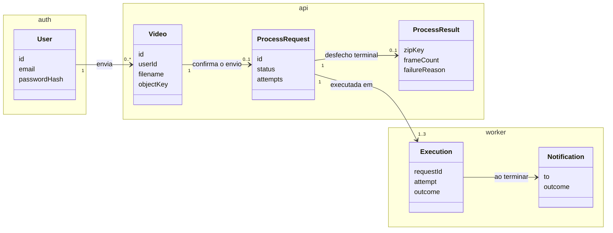
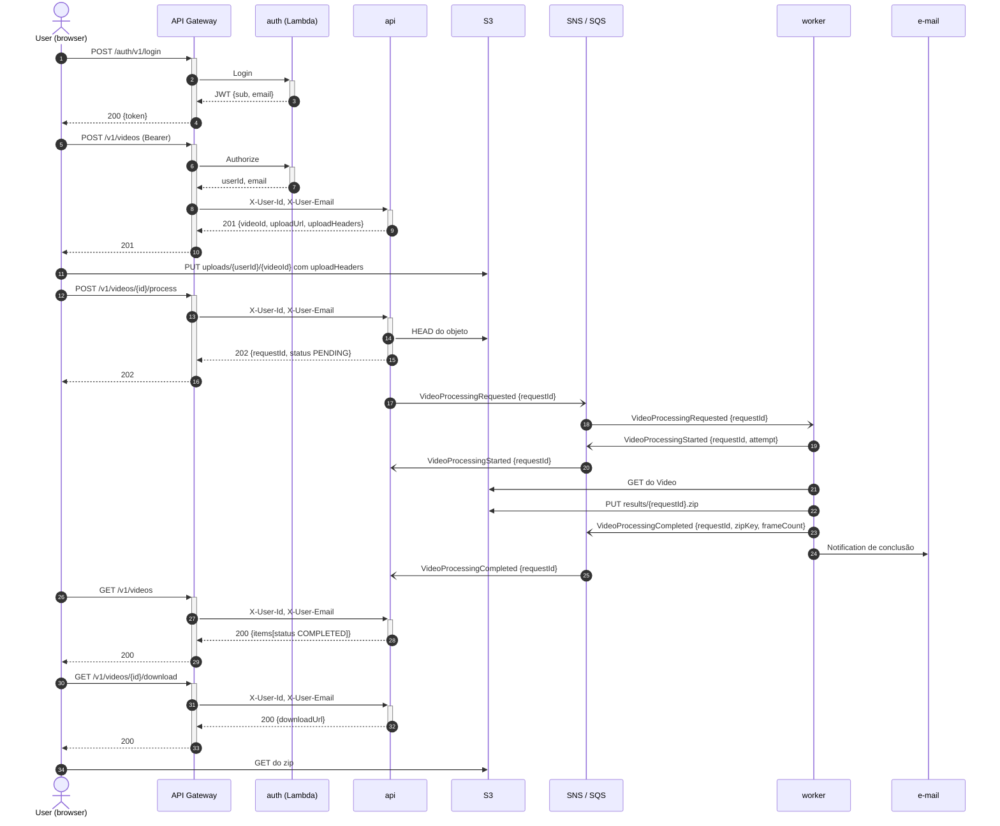

# FIAP X Video Processor

[](https://sonarcloud.io/summary/new_code?id=fiap-video-processor-api)
[](https://sonarcloud.io/summary/new_code?id=fiap-video-processor-worker)
[](https://sonarcloud.io/summary/new_code?id=fiap-video-processor-auth)

Plataforma que recebe vídeos de Users autenticados, extrai os frames de forma assíncrona e
disponibiliza o resultado em um zip, notificando o User por e-mail ao final. Três unidades de
deploy em Go, comunicando-se por eventos (SNS/SQS) e persistindo cada uma no seu próprio
PostgreSQL, sobre EKS e Lambda na AWS, em um stack completo por ambiente.

Cada serviço tem seu próprio README: [`video-processor-api`](services/video-processor-api/README.md),
[`video-processor-worker`](services/video-processor-worker/README.md) e
[`video-processor-auth`](services/video-processor-auth/README.md). A infraestrutura e sua operação
estão em [`infra/README.md`](infra/README.md), os diagramas em [`docs/diagrams/`](docs/diagrams) e
as decisões em [`docs/adr/`](docs/adr).

---

## Arquitetura

| Serviço | Onde roda | Responsabilidade |
|---|---|---|
| `video-processor-api` | EKS | Cria o Video e a URL pré-assinada de upload, confirma o envio criando a Process Request, lista os Status do User e emite o link de download do Process Result. Serve a página web. |
| `video-processor-worker` | EKS, escalado pelo KEDA | Consome `VideoProcessingRequested`, baixa o Video, extrai frames com ffmpeg, empacota o zip, publica o desfecho e envia a Notification. |
| `video-processor-auth` | Lambda | Cadastro e login por e-mail e senha, emissão do JWT e authorizer do API Gateway. |

O desenho da topologia na AWS está em [`docs/diagrams/01-topology.md`](docs/diagrams/01-topology.md)
e a estrutura interna dos serviços em [`docs/diagrams/03-service-layers.md`](docs/diagrams/03-service-layers.md).

### Domínio

Um User envia Videos. Cada Video tem exatamente uma Process Request, criada quando o envio é
confirmado, e é ela que carrega o Status que o User acompanha. O worker executa a Process Request
em uma ou mais Executions; a última delas produz o Process Result e dispara a Notification. Os
termos abaixo são usados com esta grafia no código, nos eventos, nos testes e nesta documentação.

| Termo | Definição | Vive em |
|---|---|---|
| **User** | Pessoa autenticada por e-mail e senha, dona de tudo que deriva dos seus Videos | auth |
| **Video** | Arquivo enviado por um User; existe desde que o envio é iniciado. Um Video cuja URL de upload venceu sem Process Request é abandonado: não aparece para o User e o objeto expira no armazenamento | api |
| **Process Request** | Pedido de extrair os frames de um Video; uma por Video; carrega o Status | api |
| **Status** | `PENDING`, `PROCESSING`, `COMPLETED` ou `FAILED`; os dois últimos são terminais | api |
| **Process Result** | Desfecho de uma Process Request terminal: o zip e a contagem de frames, ou o motivo da falha | api |
| **Frame Rate** | Frames por segundo extraídos; definido pela plataforma, não pelo User | worker |
| **Execution** | Uma tentativa concreta de processar uma Process Request | worker |
| **Attempt** | Número ordinal da Execution dentro da Process Request; no máximo três | worker |
| **Retryable Failure** | Falha transitória que justifica nova Attempt | worker |
| **Unprocessable Video** | Video com defeito no arquivo; encerra a Process Request como `FAILED` sem nova Attempt | worker |
| **Notification** | E-mail ao dono quando a Process Request chega a um Status terminal | worker |



Os serviços não compartilham banco nem código: a api conhece a Execution só pelos eventos do
worker, e o worker conhece o Video só pela chave do objeto que recebe no evento.

### Fluxo de um Video

Caminho feliz, do login ao download. As falhas estão em
[`docs/diagrams/02-failure-scenarios.md`](docs/diagrams/02-failure-scenarios.md).



| Passo | Detalhe |
|---|---|
| 6–8 | O authorizer valida o Bearer e o gateway injeta `X-User-Id` e `X-User-Email` com `overwrite:`, o que impede o cliente de forjá-los. A api confia nos headers e não conhece o segredo do JWT ([ADR 0003](docs/adr/0003-auth-in-lambda-and-header-trust.md)). Rotas públicas (`/`, `/health`, assets, `/auth/*`) removem esses headers. |
| 9–11 | O upload é direto no S3 porque o API Gateway limita o corpo a 10 MB e um Video pode ter 500 MB. A URL pré-assinada vale 15 minutos e amarra bucket, chave, content type, tamanho e os metadados `user-id` e `video-id`. |
| 14–17 | O `HEAD` confere que o objeto existe e que o metadado bate com o dono do Video (`409 upload_mismatch` se não). A Process Request nasce `PENDING` na mesma transação que grava o evento no outbox, e o relay publica no SNS: nenhuma Process Request se perde entre a api e a fila. |
| 18–25 | O worker cria uma Execution, extrai um frame por segundo, sobe o zip, publica o desfecho, envia a Notification e só então apaga a mensagem da fila. Uma entrega duplicada encontra a Execution terminal e apenas republica. |
| 30–34 | A URL de download vale 1 hora e só sai para o dono de uma Process Request `COMPLETED`. |
| fora do desenho | Unprocessable Video encerra a Process Request como `FAILED` na primeira Attempt. Retryable Failure devolve a mensagem à fila até três Attempts. Uma Notification que falha também devolve a mensagem. Mensagens que estouram o `maxReceiveCount` caem na DLQ. |

### Eventos

Envelope `{eventId, eventType, eventVersion, occurredAt, payload}` com atributos SNS `eventType`
e `traceparent`. Um tópico por publicador e uma fila por consumidor
([ADR 0001](docs/adr/0001-sns-sqs-for-events.md)):

| Evento | Publicador | Consumidor | Payload |
|---|---|---|---|
| `VideoProcessingRequested` | api (outbox) | worker | `requestId, videoId, userId, userEmail, objectKey, filename` |
| `VideoProcessingStarted` | worker | api | `requestId, attempt` |
| `VideoProcessingCompleted` | worker | api | `requestId, zipKey, frameCount, durationMs` |
| `VideoProcessingFailed` | worker | api | `requestId, reason, retryable, attempt` |

A api é idempotente por `eventId` e por transição de Status permitida. O worker é idempotente pela
tabela `processing_execution`.

### Escala

O worker roda com `WORKER_CONCURRENCY=2` e limite de 2 CPUs por pod. O KEDA observa a fila de
entrada (`queueLength=2`) e escala de 1 a 6 réplicas. A visibilidade da mensagem é de 5 minutos,
renovada a cada 60 segundos enquanto o ffmpeg trabalha.

### Fronteiras

Cada serviço organiza `internal/` em `domain`, `adapters/{inbound,outbound}`, `platform` e `app`,
no padrão ports and adapters, com as regras de importação entre as camadas verificadas pelo lint
na CI ([ADR 0005](docs/adr/0005-hexagonal-layout-with-import-rules.md)). Os casos de uso são
nomeados pela instrução que executam (`CreateVideo`, `ProcessVideo`, `ExecuteProcessRequest`,
`Authorize`) e os handlers de cada entrada espelham esses nomes.

### Observabilidade

- **Prometheus**: coleta o `/metrics` de cada serviço (RED por rota na api, mensagens da fila e
  Executions no worker) e avalia as regras de alerta.
- **Grafana**: três dashboards provisionados pelo Terraform (APM, Processing Operations, Errors).
- **OpenTelemetry + Alloy + Tempo**: um span por request HTTP e por mensagem consumida, exportado
  por OTLP e consultável no Grafana.
- **slog**: logs JSON estruturados.

---

## Estrutura de Pastas

```
fiap-video-processor/
├── services/
│   ├── video-processor-api/        # cmd/api, internal/{domain/video,adapters,platform,app}, web/, db/migrations, infra/k8s, README.md
│   ├── video-processor-worker/     # cmd/worker, internal/{domain/video,adapters,platform,app}, db/migrations, infra/k8s, README.md
│   └── video-processor-auth/       # cmd/{signup,login,authorizer,migrate,local}, internal/{domain/user,adapters,platform,app}, README.md
├── infra/
│   ├── environments/{staging,prod}/   # raízes finas do Terraform, uma por ambiente
│   ├── modules/                       # módulo-raiz (main, locals, ssm) e as folhas vpc, eks, rds, registry, storage, messaging, lambda, gateway, keda, observability, external-secrets
│   └── README.md                      # o que cada ambiente cria, contrato SSM, secrets, túneis
├── e2e/                            # testes ponta a ponta em Go contra o stack do Compose
├── deploy/local/                   # init do LocalStack e nginx do Compose
├── docs/{adr,diagrams}/            # decisões e diagramas mermaid
├── scripts/                        # túneis para Grafana e RDS, validador de dashboards
├── .github/workflows/              # CI/CD
├── docker-compose.yml
├── Makefile
└── go.work
```

Cada serviço tem seu próprio `go.mod` e não compartilha código com os outros: o envelope de eventos
e os headers de identidade são duplicados deliberadamente para que qualquer serviço possa ser
extraído para um repositório próprio sem refatoração
([ADR 0002](docs/adr/0002-monorepo-with-self-contained-services.md)).

A página web é uma SPA estática (`services/video-processor-api/web/`: HTML, CSS e JS puros)
embutida no binário da api com `embed` e servida em `GET /`. Ela guarda o JWT no browser, envia os
headers de identidade e faz polling da listagem a cada 5 segundos.

---

## Stack

- **Linguagem**: Go 1.27, `net/http` puro, `pgx/v5` com SQL manual, `golang-migrate`
- **Processamento**: ffmpeg
- **Mensageria**: Amazon SNS e SQS (transactional outbox na api)
- **Armazenamento**: Amazon S3 com URLs pré-assinadas, PostgreSQL 16 no RDS, uma instância por serviço
- **Autenticação**: JWT HS256 emitido por Lambda, bcrypt, API Gateway HTTP API com Lambda authorizer
- **Plataforma**: EKS, Kustomize, KEDA, External Secrets Operator, Helm via Terraform
- **Observabilidade**: Prometheus, Grafana, OpenTelemetry, Alloy, Tempo
- **Testes**: testify, fakes escritos à mão, testcontainers-go (PostgreSQL, LocalStack, Mailpit), e2e em Go
- **Qualidade**: golangci-lint v2, SonarCloud
- **Infra e entrega**: Terraform, Docker, GitHub Actions, GHCR

---

## Execução Local

Requisitos: Docker e `make`. O Go 1.27 só é necessário para `make test` e `make lint` fora dos
containers; subir o stack e rodar o e2e usam apenas Docker.

```bash
make up          # sobe os três Postgres, LocalStack, Mailpit, migrações, api, worker, auth e o gateway nginx
make e2e         # make up + testes ponta a ponta num container Go (signup → login → upload → process → download)
make down        # derruba tudo e apaga os volumes
```

Acesse:

- Página web e API: http://localhost:8080 (o nginx faz o papel do API Gateway: `/auth/*` vai para
  o auth, o resto para a api)
- Mailpit (caixa de entrada das Notifications): http://localhost:8025
- LocalStack: http://localhost:4566

Um container Postgres por serviço, espelhando a instância RDS de cada um:

| Serviço | Host:porta | Database | User / senha |
|---|---|---|---|
| api | `localhost:5432` | `video_processor_api` | `app_api` / `app` |
| worker | `localhost:5433` | `video_processor_worker` | `app_worker` / `app` |
| auth | `localhost:5434` | `video_processor_auth` | `app_auth` / `app` |

---

## Testes

```bash
make test               # unitários dos três serviços, com -race e cobertura
make test-integration   # inclui testcontainers (Postgres, LocalStack, Mailpit); requer Docker e ffmpeg no PATH
make e2e                # sobe o Compose e roda e2e/ contra o gateway local, dentro de um container Go
make lint               # golangci-lint com a configuração da raiz
```

O e2e em `e2e/` é um módulo Go autocontido: cria um User novo, envia `testdata/sample.mp4`,
espera a Process Request chegar a `COMPLETED`, baixa o zip e conta os frames, confere a
Notification no Mailpit, repete o caminho de Unprocessable Video e verifica que um User não acessa
o Video de outro.

Os testes de integração incluem um e2e por serviço: a api percorre upload, confirmação, evento no
SNS, evento de retorno e download; o worker recebe um `VideoProcessingRequested`, processa um vídeo
sintético gerado pelo ffmpeg, publica os eventos e envia o e-mail, além do caminho de Unprocessable
Video sem retries. Sem o ffmpeg no PATH os testes que dependem dele são pulados.

### Cobertura

Análise a cada PR e a cada push em `main` pelo workflow `_service-ci.yaml`, um projeto SonarCloud
por serviço (`fiap-video-processor-api`, `-worker`, `-auth`). O quality gate exige 80% de
cobertura em código novo e falha o PR. Ficam fora da contagem os `cmd/`, o `testinfra` e os e2e,
que não têm lógica própria.

---

## API

Base pública: URL do API Gateway do ambiente. Erros seguem `{"error": "<code>", "message": "<texto>"}`.

| Rota | Auth | Resposta | Descrição |
|---|---|---|---|
| `POST /auth/v1/signup` | pública | `201 {id, email}` · `400 invalid_email/weak_password` · `409 email_taken` | Cria o User |
| `POST /auth/v1/login` | pública | `200 {token}` · `401 invalid_credentials` | Emite o JWT (`sub`, `email`) |
| `POST /v1/videos` | Bearer | `201 {videoId, uploadUrl, uploadHeaders, expiresAt}` · `422 unsupported_format/video_too_large` | Cria o Video e a URL de upload (limite 500 MB); o PUT deve enviar `uploadHeaders` |
| `POST /v1/videos/{id}/process` | Bearer | `202 {requestId, status: PENDING, ...}` · `404` · `403` · `409 upload_not_found/upload_mismatch` | Confirma o envio e cria a Process Request |
| `GET /v1/videos` | Bearer | `200 {items: [{requestId, videoId, filename, status, attempts, result?}]}` | Lista as Process Requests do User |
| `GET /v1/videos/{id}/download` | Bearer | `200 {downloadUrl}` · `403` · `404` · `409 not_completed` | URL pré-assinada do zip |
| `GET /health` | pública | `200` | Health da api |
| `GET /` | pública | HTML | Página web |

Os testes em [`e2e/`](e2e) percorrem todas as rotas na ordem de uso.

---

## Deploy e Infraestrutura

Cada serviço carrega seus manifestos Kustomize em `services/<svc>/infra/k8s/{base,overlays/{staging,prod}}`.
O deploy lê os parâmetros do SSM, reescreve os patches do overlay, aplica o ExternalSecret, roda o
Job de migração com a mesma imagem do serviço e aguarda o rollout. O auth roda em Lambda e só tem
o Job de migração.

Cada ambiente (`staging`, `prod`) é um stack completo e independente criado pelo Terraform: VPC,
cluster EKS com KEDA, External Secrets e observabilidade, uma instância RDS por serviço, bucket S3,
tópicos SNS e filas SQS com DLQ, Lambdas e API Gateway ([ADR 0006](docs/adr/0006-isolation-per-environment-and-service.md)).
O que cada módulo cria, o contrato SSM entre infra e deploy, os secrets do pipeline e os túneis de
acesso estão em [`infra/README.md`](infra/README.md).

### Scripts de criação do banco e dos recursos

| Recurso | Script | Quem executa |
|---|---|---|
| Esquema de cada serviço (tabelas `video`, `video_process_request`, `video_process_result`, `outbox`, `processed_event`, `processing_execution`, `notification_log`, `"user"`) | `services/<svc>/db/migrations/*.up.sql` e `*.down.sql` (golang-migrate) | Job de migração no Kubernetes (`<binário> migrate`) e `migrate-*` no Compose |
| Instância RDS, banco e usuário de cada serviço | `infra/modules/rds` chamado por `infra/modules/main.tf` | Terraform, raízes `staging` e `prod` |
| Bancos locais | serviços `postgres-*` do `docker-compose.yml` | Compose, na primeira subida |
| Bucket, filas, tópicos, Lambdas, API Gateway, cluster | `infra/` (Terraform) | `infra-deploy.yaml` |
| Bucket, filas e tópicos locais | `deploy/local/localstack/init.sh` | Compose, no boot do LocalStack |

---

## CI/CD

| Workflow | Trigger | O que faz |
|---|---|---|
| `video-processor-<svc>-pr-check.yaml` | PR que toca o serviço | vet, golangci-lint, testes com `-race` e integração, SonarCloud com quality gate |
| `video-processor-<svc>-build-and-deploy.yaml` | push em `main` que toca o serviço | CI → imagem no GHCR (`sha-<short>`) → deploy em `staging`; `prod` só por disparo manual com `deploy_prod` |
| `infra-pr-check.yaml` | PR que toca `infra/` | `fmt`, `validate` das duas raízes, `terraform test` dos módulos, `plan` por raiz comentado no PR |
| `infra-deploy.yaml` | push em `main` que toca `infra/` | `apply` de `staging`; `prod` só por disparo manual com `deploy_prod` |

O push em `main` só aplica o `staging`. O `prod` roda quando o workflow é disparado à mão com a
opção `deploy_prod`, e mesmo assim para no GitHub Environment `production`, que exige aprovação.
O deploy de um serviço espera terminar qualquer `infra deploy` do mesmo ambiente que esteja em
andamento, para que os parâmetros do SSM já existam quando um push toca serviço e infra ao mesmo
tempo. Os secrets que o pipeline precisa estão listados em [`infra/README.md`](infra/README.md#secrets-do-pipeline).

---

## ADRs

As decisões de arquitetura estão em [`docs/adr/`](docs/adr), uma por arquivo.
