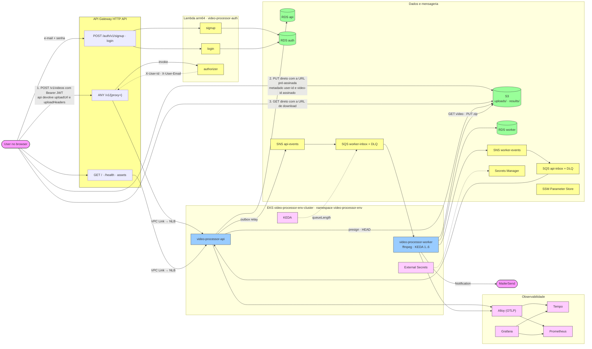

# 01. Topologia

Onde cada componente do FIAP X Video Processor roda na AWS. Cada ambiente (`staging`, `prod`) é
um stack completo e independente: VPC, cluster EKS com seus add-ons, três instâncias RDS (uma por
serviço), bucket, filas, Lambdas e API Gateway próprios. O desenho abaixo é um ambiente.

O upload e o download não passam pelos serviços: a api emite URLs pré-assinadas e o browser fala
direto com o S3 (passos 2 e 3 abaixo). O API Gateway HTTP API limita o corpo a 10 MB, então um
Video de até 500 MB nunca poderia atravessá-lo.

| Cor | Significado |
|---|---|
| Rosa | Atores externos: o User e o provedor de e-mail |
| Amarelo | Serviços gerenciados da AWS |
| Azul | Serviços deste repositório rodando no EKS |
| Verde | Armazenamento de dados |
| Lilás | Operadores e observabilidade |

Localmente o Compose substitui o API Gateway por um nginx que só roteia (`deploy/local/gateway/`),
as Lambdas por `cmd/local` do auth, o S3, SNS e SQS pelo LocalStack e o MailerSend pelo Mailpit.
