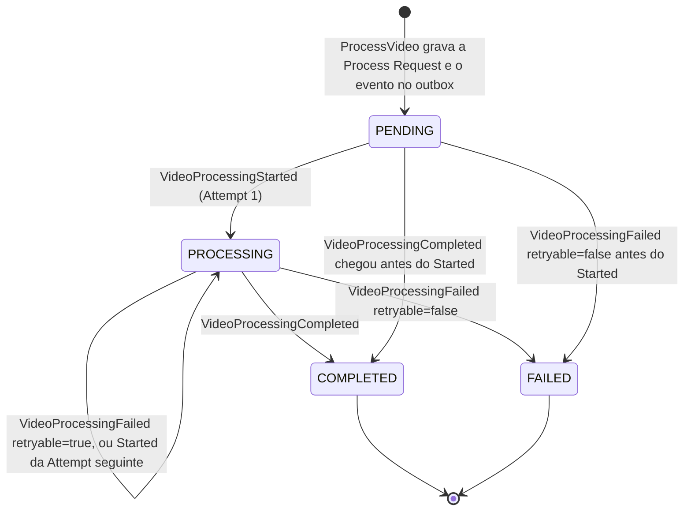

# 02. Cenários de falha

O que acontece quando cada passo do [fluxo de um Video](../../README.md#fluxo-de-um-video) falha,
o que o User vê e como o sistema se recupera. Termos conforme o glossário do
[README](../../README.md#domínio).

## Catálogo

| # | Cenário | Como é detectado | Status da Process Request | O que o User vê | Recuperação |
|---|---|---|---|---|---|
| F1 | A assinatura da URL de upload falha depois de gravar o Video | erro no presign | não existe | `500 internal_error` no `POST /v1/videos` | O User repete o envio; a linha `video` órfã é inofensiva (F2) |
| F2 | O PUT no S3 falha ou o User fecha a aba | nada acontece no servidor | não existe | Nada na listagem: ela mostra Process Requests | O objeto, se chegou parcial, expira em 7 dias pelo lifecycle; a linha `video` permanece sem uso |
| F3 | `/process` antes do objeto existir ou com o S3 fora | `HEAD` devolve ausente ou erro | não existe | `409 upload_not_found` ou `500 internal_error` | A página só chama `/process` após o PUT; em erro o User tenta de novo |
| F4 | Objeto sem o metadado de dono ou com dono diferente | `HEAD` compara `user-id` e `video-id` com o Video | não existe | `409 upload_mismatch` | Só acontece se o PUT não usou os `uploadHeaders` devolvidos pela api; o User reenvia |
| F5 | SNS fora do ar quando o relay tenta publicar | erro no `Publish` | `PENDING` | Listagem em `PENDING` | O evento fica no outbox; o relay tenta a cada 2 s na ordem original e nada se perde |
| F6 | Unprocessable Video: ffmpeg rejeita o arquivo, ou o objeto sumiu do S3 | saída do ffmpeg ou `NoSuchKey` | `FAILED` na Attempt 1 | `FAILED` com o motivo e a Notification de falha | Nenhuma nova Attempt; o User envia outro arquivo |
| F7 | Retryable Failure: S3, banco, disco ou ffmpeg falhando por causa transitória | erro que não é de conteúdo | `PROCESSING` até a Attempt 3, então `FAILED` | Listagem com `attempts` subindo | `VideoProcessingFailed{retryable=true}`, mensagem volta à fila após 30 s, próxima entrega é a Attempt n+1 |
| F8 | Pod do worker morre no meio da Execution | visibility timeout de 5 min expira sem heartbeat | `PROCESSING` | Igual a F7 | O SQS reentrega; o `ApproximateReceiveCount` vira a nova Attempt |
| F9 | Publicar o desfecho falha depois de processar | erro no `Publish` | `PROCESSING` | Listagem parada em `PROCESSING` por instantes | Mensagem volta à fila; a próxima entrega encontra a Execution terminal e só republica, sem rodar o ffmpeg de novo |
| F10 | Provedor de e-mail fora do ar | erro no envio da Notification | terminal, já publicado | Status correto, e-mail atrasado | Mensagem volta à fila; a próxima entrega republica o desfecho e reenvia; `notification_log` impede e-mail duplicado |
| F11 | Evento duplicado ou fora de ordem chega à api | `processed_event` por `eventId`; transição inválida | inalterado | Nada | Duplicado é ignorado; `Completed` antes de `Started` completa direto; transição inválida é descartada com ack |
| F12 | Três entregas sem ack | `maxReceiveCount=3` | preso em `PENDING` ou `PROCESSING` | Listagem parada | Mensagem na DLQ; redrive manual pelo console. Não há alerta (limitação conhecida) |
| F13 | Download antes de `COMPLETED` ou de Video de outro User | Status ou dono | inalterado | `409 not_completed`, `403 forbidden` ou `404 not_found` | Nenhuma; é a regra |

## Status da Process Request

`COMPLETED` e `FAILED` são terminais: qualquer evento posterior é descartado (F11). Uma mensagem
que morreu na DLQ deixa a Process Request no Status em que estava (F12).
