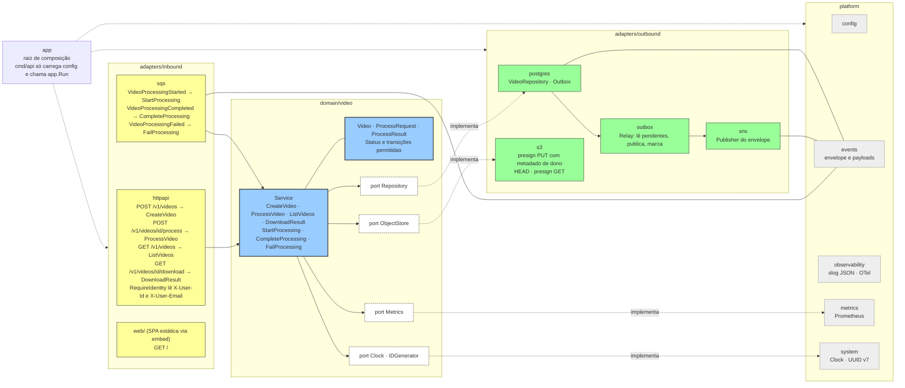

# 03. Os serviços por dentro

Os três serviços têm a mesma forma: a entrada (HTTP, fila ou evento Lambda) é traduzida em um caso
de uso do domínio, e o domínio sai pelos ports que os adapters de saída implementam. `app` é o
único lugar que sabe qual adapter concreto entra em cada port, e `cmd` só carrega a configuração e
chama `app`. As regras de importação entre as camadas estão no
[ADR 0005](../adr/0005-hexagonal-layout-with-import-rules.md). O desenho abaixo usa a
`video-processor-api`; os nomes são os pacotes reais de `services/video-processor-api/internal/`.

## O mesmo desenho nos outros dois serviços

| | `video-processor-worker` | `video-processor-auth` |
|---|---|---|
| Entrada | `sqs`: consumer com concorrência 2 e heartbeat de visibilidade, `VideoProcessingRequested` → `ExecuteProcessRequest` | `lambdahttp` converte o evento do API Gateway em `net/http` para o `httpapi` (`SignUp`, `Login`); `authorizer` lê o Bearer → `Authorize` |
| Domínio | `domain/video`: `ProcessRequest`, `Execution` (Attempt, Outcome), `Notification`, `UnprocessableError`, `ErrRetryLater` | `domain/user`: `User`, `Credentials`, `Session`, `Identity` |
| Ports | `ObjectStore`, `Extractor`, `Packager`, `Workspace`, `Repository`, `Publisher`, `Notifier`, `Clock`, `IDGenerator`, `Metrics` | `Repository`, `PasswordHasher`, `TokenIssuer`, `TokenVerifier`, `Clock`, `IDGenerator` |
| Saída | `s3`, `ffmpeg` (distingue defeito do arquivo de falha transitória), `zip`, `workspace`, `postgres`, `sns`, `mail` (MailerSend na AWS, SMTP no Compose) | `postgres`, `password` (bcrypt), `jwt` (HS256) |
| Composição | `app.Run` monta o consumer com o `Service` | `SignUpLambda`, `LoginLambda`, `AuthorizerLambda`, `RunLocalServer` (Compose) e `Migrate`, um binário em `cmd/` por papel |

No worker o domínio decide o desfecho da Execution sem saber que existe fila: ele devolve
`ErrRetryLater` quando a mensagem deve voltar, e o consumer traduz isso em visibilidade da mensagem.
No auth o authorizer não abre conexão com o banco: compõe só o verificador JWT com o caso de uso
`Authorize`, e o API Gateway cacheia a resposta por 5 minutos.
